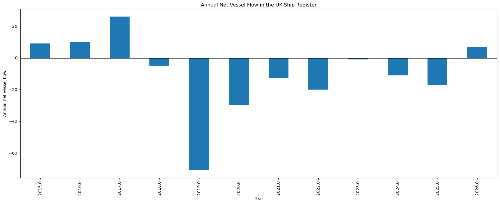

# UK Ship Register Analysis

Exploratory data analysis of the UK Ship Register using publicly available
UK government data, focusing on long‑term structural trends and vessel
registration dynamics.

---

## Project Overview

This project analyses the UK Ship Register to understand how the number of
UK‑registered merchant vessels has changed over time. Using both annual and
monthly datasets, the analysis integrates long‑term trends with short‑term
inflow and outflow dynamics to identify potential structural shifts in the
register.

The project is designed as a real‑world data analysis exercise, working with
messy public‑sector datasets and prioritising reproducible, interpretable
results over black‑box modelling.

---

## Key Findings

### Long‑Term Trend (Annual Data)

The annual statistics show a sustained decline in the number of UK‑registered
merchant vessels from the late 2010s onwards, suggesting a structural change
rather than short‑term volatility.

### Underlying Dynamics (Monthly Data)

onthly inflow and outflow analysis reveals repeated periods of net vessel
outflow, where more vessels leave the UK Ship Register than enter. Although
monthly movements are volatile, their cumulative effect provides a clear
mechanism behind the long‑term decline observed in the annual data.

---

## Data Sources

- **UK Ship Register Annual Statistics (FLE0100a)**
- **UK Ship Register Monthly Inflow and Outflow Data (FLE0100b)**

Source: UK Government / Maritime and Coastguard Agency  
Licence: Open Government Licence

---

## Methodology

- Loading and inspecting multi‑row government CSV files
- Cleaning and restructuring inconsistent headers and metadata
- Handling missing values without introducing artificial trends
- Exploratory data analysis of:
  - Annual long‑term trends
  - Monthly inflow and outflow dynamics
- Time‑series visualisation to support interpretation and communication
  of insights

---

## Tools

- Python
- pandas
- matplotlib
- Jupyter Notebook

---

## Data Availability

Raw input data files are not stored in this repository.

To reproduce the analysis, please download the datasets from the UK Government
Ship Register and place them in the following directory:

[images]: images/.png